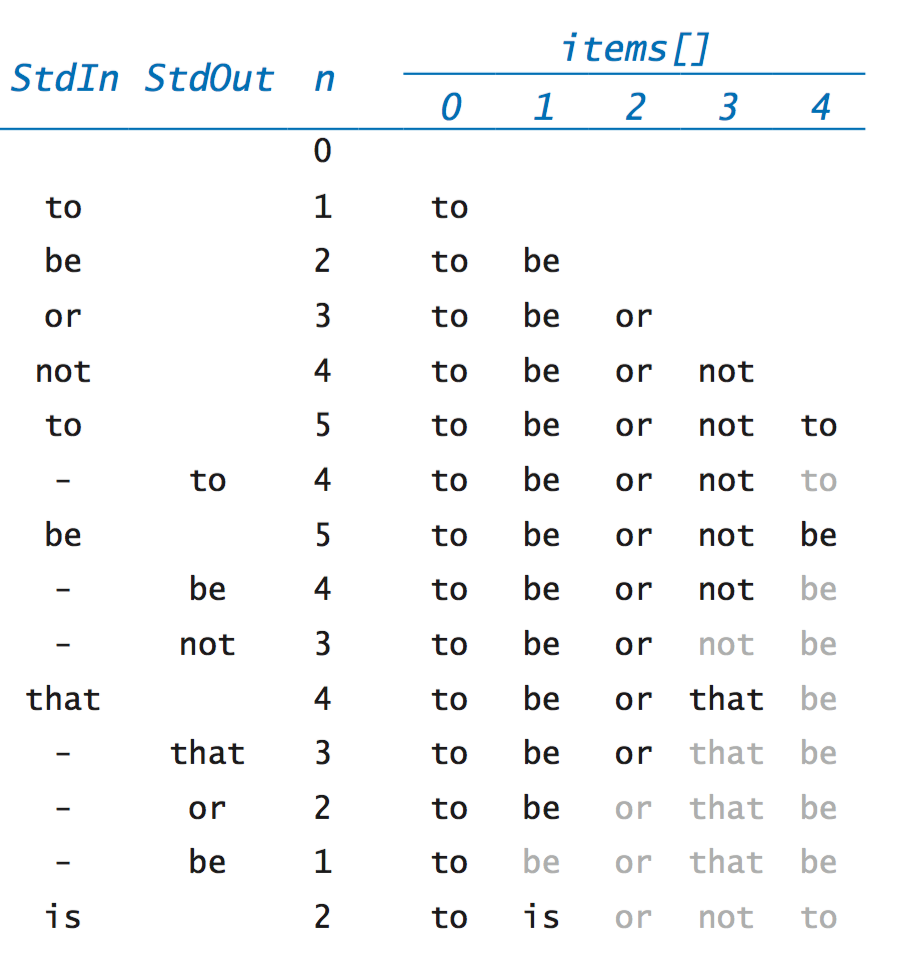
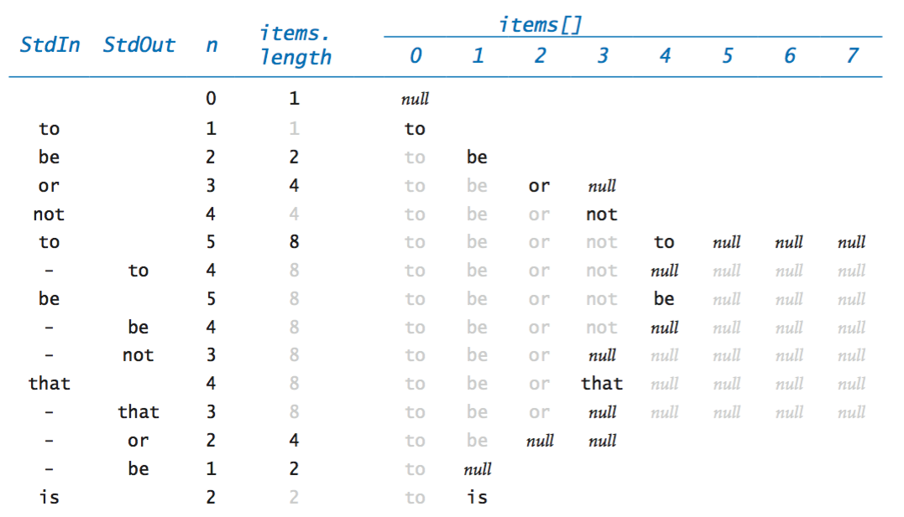

# Stacks

A stack is a collection of elements that is based on the last-in-first-out (LIFO) policy

Following conventions, we name the stack insert method push() and the stack remove operation pop()

We also include a method to test whether the stack is empty, as indicated in the following API:

We maintain an instance variable n that stores the number of items in the stack and an array items[] that stores the n items, with the most recently inserted item in items[n-1] and the least recently inserted item in items[0]

This policy allows us to add and remove items at the end without moving any of the other items in the stack

- To remove an item, we decrement n and then return a[n]; to insert a new item, we set a[n] equal to the new item and then increment n.

ResizingArrayStackOfStrings.java is a version of ArrayStackOfStrings.java that dynamically adjusts the length of the array items[] so that it is sufficiently large to hold all of the items and but not so large as to waste an excessive amount of space

First, in push(), we check whether there is room for the new item; if not, we create a new array of double the length of the old array and copy the items from the old array to the new array

Similarly, in pop(), we check whether the array is too large, and we halve its length if that is the case

This doubling-and-halving strategy guarantees that that the stack never overflows and never becomes less than one-quarter full

- ResizingArrayStack.java implements a generic stack using a resizing array. For technical reasons, a cast is needed when allocating the array of generics.