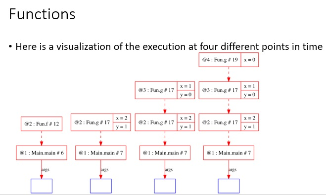

#Functions

What is a function?

Example:

```java
public class Main {
  private Main() {}
  static public void main (final String[] args) {
    //stdlib.Trace.graphvizShowSteps (true); stdlib.Trace.run ();
    Fun.f();
    Fun.g(2);
  }
}
class Fun {
  private Fun() {}
  static void f() { System.out.println("Fun.f()"); }
  static void g(final int x) {
    System.out.println("Fun.g(" + x + ")");
    if (x>0) {
      final int y = x-1;
      Fun.g(y);
    }
  }
}
```

***

###Here is a visualization of the execution at four different points in time



***

##Activation
-

Each function call (or activation) creates an instance of the function variables (including parameters).

The variables are stored in an activation record instance (ARI).

The period from activation to return is the lifetime of the ARI.

- Memory is allocated by the system at birth
- Memory is returned to the system at death

We can draw ARI's, including an instance number to distinguish them